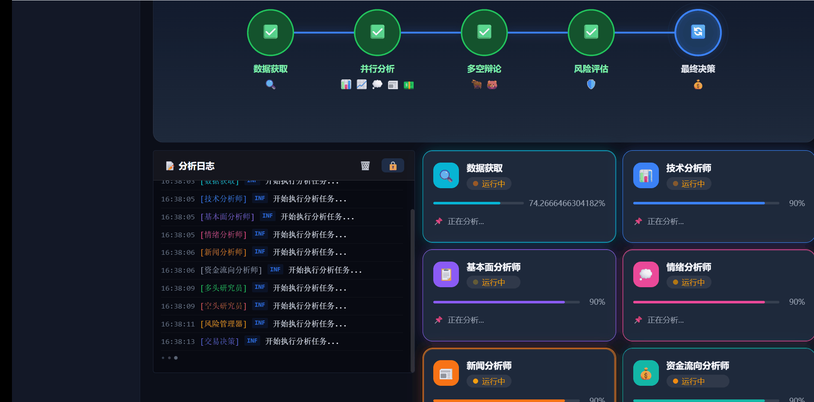

# AStockAgents 🤖

<div align="center">

[](https://www.python.org/)
[](LICENSE)
[](https://github.com/astock-agents/astock-agents)
[](https://github.com/astock-agents/astock-agents/releases)

**Multi-Agent Collaborative Stock Analysis System**

A comprehensive AI-driven stock analysis framework built on LangGraph, featuring 10 specialized agents for technical analysis, fundamental analysis, sentiment analysis, bull/bear debate, risk management, and more.

## 🎨 截图预览




[快速开始](#快速开始) · [功能特性](#功能特性) · [架构设计](#架构设计) · [多LLM支持](#多llm支持) · [API文档](#api文档)

</div>

---

## 📖 项目简介

AStockAgents 是一个面向 **A股市场** 的智能量化分析系统，采用多智能体协同架构，模拟专业投资研究团队的工作流程。

### 🎯 核心创新

| 创新点 | 说明 |
|--------|------|
| **10个专业智能体** | 技术/基本面/情绪/新闻/资金流向/多空辩论/交易/风控 |
| **三层混合决策架构** | 规则引擎+LLM增强+风控强制 |
| **年轮记忆系统** | 投资画像、偏好学习、持续进化 |
| **博弈论辩论** | 纳什均衡、囚徒困境、多轮对抗 |
| **金融合规设计** | 免责声明注入、FOMO检测、审计日志 |
| **多源数据降级** | mootdx→akshare→腾讯→东财→百度→巨潮 |

### 👥 智能体团队

```
数据获取 ──┬── 技术分析师 ──┐
           ├── 基本面分析师 ──┤
           ├── 情绪分析师   ──┤
           ├── 新闻分析师   ──┤
           ├── 资金流向分析师 ──┤
           └── 宏观分析师   ──┘
                              │
              多头研究员 ←──→ 空头研究员
                     (博弈论辩论)
                         │
              交易员 ←────→ 风险管理
                     ↓
                  决策输出
```

---

## ✨ 功能特性

### 核心功能

- 🔥 **多源数据整合**: 6级数据源自动降级，A股全覆盖
- 📊 **全面技术分析**: 10+技术指标、15+K线形态识别
- 🤖 **LLM智能增强**: 本地模型/OpenRouter免费/国产LLM
- ⚖️ **博弈论辩论**: 多轮对抗、纳什均衡、囚徒困境
- 📈 **完整回测系统**: 3年A股回测、Sharpe/最大回撤/胜率
- 🛡️ **金融合规设计**: 免责声明、FOMO检测、审计追踪
- 🧠 **年轮记忆系统**: 投资画像、偏好学习、持续进化
- 🔌 **MCP协议支持**: 6个标准化金融工具接口

### 技术指标

| 指标 | 说明 |
|------|------|
| MA(5,10,20,60,120) | 移动平均线系统 |
| MACD | 指数平滑异同移动平均线 |
| RSI | 相对强弱指标 |
| KDJ | 随机指标 |
| Bollinger | 布林带 |
| ATR | 真实波幅 |
| OBV | 能量潮 |
| Williams %R | 威廉指标 |
| CCI | 顺势指标 |
| ADX | 平均趋向指标 |

### K线形态

- 吞没形态（看涨/看跌）
- 孕线形态
- 早晨之星/黄昏之星
- 锤子线/流星线
- 双底/双顶
- 头肩顶/头肩底
- 三只白兵/三只乌鸦

---

## 🚀 快速开始

### 环境要求

- Python 3.10+
- Windows/Linux/macOS

### 安装

```bash
# 克隆项目
git clone https://github.com/astock-agents/astock-agents.git
cd astock-agents

# 创建虚拟环境
python -m venv .venv
source .venv/bin/activate  # Linux/macOS
# .venv\Scripts\activate  # Windows

# 安装依赖
pip install -r requirements.txt

# 安装项目
pip install -e .
```

### 配置

```bash
# 复制配置模板
cp .env.example .env

# 编辑配置（至少配置一个LLM提供商）
# LLM_PROVIDER=local  # 本地模型
# LLM_PROVIDER=openrouter  # OpenRouter免费模型
# LLM_PROVIDER=qwen  # 通义千问
```

### 运行

```bash
# 命令行Demo
python examples/demo.py --code 600519.SH --name 贵州茅台

# Web界面
python -m astock_agents.web.app
# 访问 http://localhost:8000
```

### Docker部署

```bash
# 使用Docker Compose
docker-compose up -d
```

---

## 🏗️ 架构设计

```
┌─────────────────────────────────────────────────────────────┐
│                        AStockAgents                          │
├─────────────────────────────────────────────────────────────┤
│                                                              │
│  ┌──────────────┐   ┌──────────────┐   ┌──────────────┐   │
│  │    数据层     │   │   智能体层    │   │    应用层     │   │
│  │              │   │              │   │              │   │
│  │ • Mootdx     │   │ • Technical  │   │ • CLI        │   │
│  │ • Akshare    │   │ • Fundamental│   │ • Web UI     │   │
│  │ • Tencent    │   │ • Sentiment  │   │ • REST API   │   │
│  │ • Eastmoney  │   │ • News       │   │ • WebSocket  │   │
│  │ • Baidu      │   │ • Bull/Bear  │   │              │   │
│  │ • Cninfo     │   │ • CapitalFlow│   │              │   │
│  │              │   │ • Risk       │   │              │   │
│  └──────────────┘   └──────────────┘   └──────────────┘   │
│                                                              │
│  ┌──────────────────────────────────────────────────────┐   │
│  │           工作流编排 (LangGraph StateGraph)           │   │
│  │  ┌─────────┐  ┌─────────┐  ┌─────────┐  ┌────────┐ │   │
│  │  │数据获取 │→│分析师 │→│辩论 │→│交易 │ │   │
│  │  │  Node  │  │  Node   │  │  Node   │  │ Node   │ │   │
│  │  └─────────┘  └─────────┘  └─────────┘  └────────┘ │   │
│  └──────────────────────────────────────────────────────┘   │
│                                                              │
│  ┌──────────────────────────────────────────────────────┐   │
│  │                    服务层                             │   │
│  │  • 合规审查 • FOMO检测 • 回测引擎 • 风控管理          │   │
│  │  • 仓位计算 • 通知推送 • 定时调度 • 审计追踪          │   │
│  └──────────────────────────────────────────────────────┘   │
│                                                              │
└─────────────────────────────────────────────────────────────┘
```

详细架构请参考 [架构文档](docs/ARCHITECTURE.md)

---

## 🔌 多LLM支持

### 支持的提供商

| 提供商 | 免费额度 | 模型示例 |
|--------|----------|----------|
| **本地模型** | 完全免费 | gemma4, llama3, Qwen |
| **OpenRouter** | 每日免费 | google/gemma-4-31b-it:free |
| **通义千问** | 有免费额度 | qwen-turbo |
| **DeepSeek** | 有免费额度 | deepseek-chat |
| **智谱AI** | 有免费额度 | glm-4 |
| **OpenAI** | 付费 | GPT-4o |
| **Anthropic** | 付费 | Claude-3.5 |

### 配置示例

```bash
# .env

# 本地模型（推荐gemma4）
LLM_PROVIDER=local
LOCAL_LLM_BASE_URL=http://127.0.0.1:8080/v1
LOCAL_LLM_MODEL=gemma4

# 或使用OpenRouter免费模型
LLM_PROVIDER=openrouter
OPENROUTER_API_KEY=your_key
OPENROUTER_MODEL=google/gemma-4-31b-it:free
```

---

## 📚 使用指南

### Python API

```python
from astock_agents.workflow.analysis_workflow import AnalysisWorkflow
from astock_agents.models.stock_data import StockData

# 创建工作流
workflow = AnalysisWorkflow()

# 执行分析
result = workflow.run(stock_code="600519.SH", stock_name="贵州茅台")

print(f"最终信号: {result.final_signal}")
print(f"置信度: {result.final_confidence}%")
print(f"技术分析: {result.technical_analysis.summary}")
print(f"多空辩论: {result.debate.bull_thesis}")
```

### REST API

```bash
# 分析股票
curl -X POST "http://localhost:8000/api/analyze" \
  -H "Content-Type: application/json" \
  -d '{"stock_code": "600519.SH", "stock_name": "贵州茅台"}'

# 获取热门股票
curl "http://localhost:8000/api/stocks/popular"

# 多股对比
curl "http://localhost:8000/api/compare?stock_codes=600519.SH,000858.SZ"

# 策略回测
curl -X POST "http://localhost:8000/api/backtest" \
  -H "Content-Type: application/json" \
  -d '{"strategy": "MACD", "stock_code": "000001.SZ"}'
```

详细使用请参考 [使用指南](docs/USER_GUIDE.md)

---

## 📖 API文档

启动Web服务后访问：
- Swagger UI: http://localhost:8000/docs
- ReDoc: http://localhost:8000/redoc

---

## 🧪 测试

```bash
# 运行所有测试
pytest

# 带覆盖率报告
pytest --cov=astock_agents --cov-report=html

# 运行特定测试
pytest tests/test_agents_layer.py -v
```

---

## 📁 项目结构

```
astock-agents/
├── astock_agents/           # 主包
│   ├── agents/              # 10个智能体
│   │   ├── technical_analyst.py    # 技术分析师
│   │   ├── fundamental_analyst.py # 基本面分析师
│   │   ├── sentiment_analyst.py    # 情绪分析师
│   │   ├── news_analyst.py         # 新闻分析师
│   │   ├── capital_flow_analyst.py # 资金流向分析师
│   │   ├── macro_analyst.py        # 宏观分析师
│   │   ├── bull_researcher.py      # 多头研究员
│   │   ├── bear_researcher.py      # 空头研究员
│   │   ├── trader.py               # 交易员
│   │   └── risk_manager.py         # 风险管理
│   ├── data/                # 6级数据源
│   │   ├── mootdx_client.py
│   │   ├── akshare_client.py
│   │   ├── tencent_client.py
│   │   ├── eastmoney_client.py
│   │   └── data_manager.py
│   ├── services/            # 22个服务
│   │   ├── compliance.py         # 合规审查
│   │   ├── fomo_guard.py         # FOMO检测
│   │   ├── backtest.py           # 回测引擎
│   │   ├── user_memory.py        # 年轮记忆
│   │   └── ...
│   ├── workflow/            # LangGraph工作流
│   ├── models/             # Pydantic数据模型
│   ├── web/                # FastAPI Web服务
│   └── config.py           # 配置管理
├── frontend/                # Vue3前端
│   └── src/
│       ├── views/          # 14个页面
│       ├── components/     # 可视化组件
│       └── services/       # API服务
├── tests/                  # 单元测试
├── scripts/                # 回测脚本
├── docs/                   # 技术文档
├── Dockerfile
├── docker-compose.yml
└── requirements.txt
```

---

## 🤝 贡献指南

欢迎贡献代码、报告问题或提出建议！

1. Fork 项目
2. 创建特性分支 (`git checkout -b feature/AmazingFeature`)
3. 提交更改 (`git commit -m 'Add some AmazingFeature'`)
4. 推送到分支 (`git push origin feature/AmazingFeature`)
5. 创建 Pull Request

详细指南请参考 [CONTRIBUTING.md](CONTRIBUTING.md)

---

## 📄 许可证

本项目采用 **CC BY-NC 4.0** (Creative Commons Attribution-NonCommercial 4.0) 许可证。

**允许**：
- 个人学习、研究使用
- 修改和再分发

**禁止**：
- 商业用途
- SaaS产品
- 盈利性服务

详细信息请参考 [LICENSE](LICENSE) 文件

---

## ⚠️ 免责声明

**本系统提供的分析结果仅供参考，不构成任何投资建议。**

股市有风险，投资需谨慎。使用本系统进行投资决策造成的任何损失，开发者不承担任何责任。请结合自身风险承受能力，独立做出投资决策。

---

## 🙏 致谢

- [LangChain](https://github.com/langchain-ai/langchain) - LLM应用框架
- [LangGraph](https://github.com/langchain-ai/langgraph) - 工作流编排
- [Akshare](https://github.com/akfamily/akshare) - 金融数据接口
- [Mootdx](https://github.com/moomindesigns/mootdx) - 通达信接口
- [TradingAgents](https://github.com/TauricResearch/TradingAgents) - 多智能体框架参考

---

<div align="center">

如果这个项目对你有帮助，请给一个 ⭐️ Star 支持一下！

Made with ❤️ by AStockAgents Team

</div>
